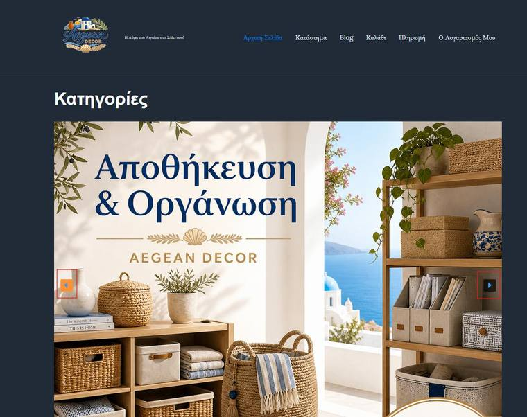
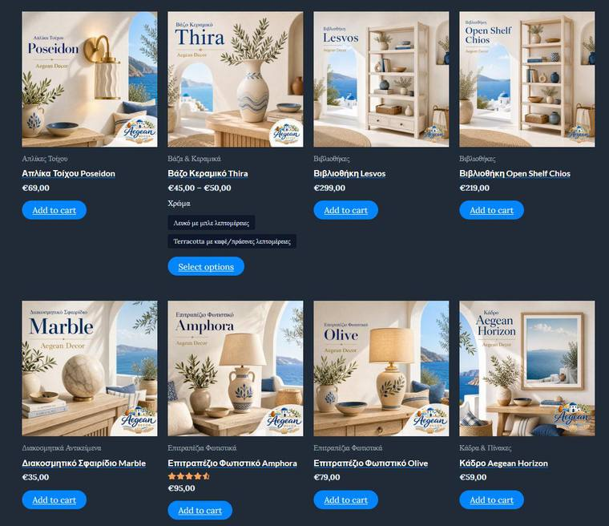
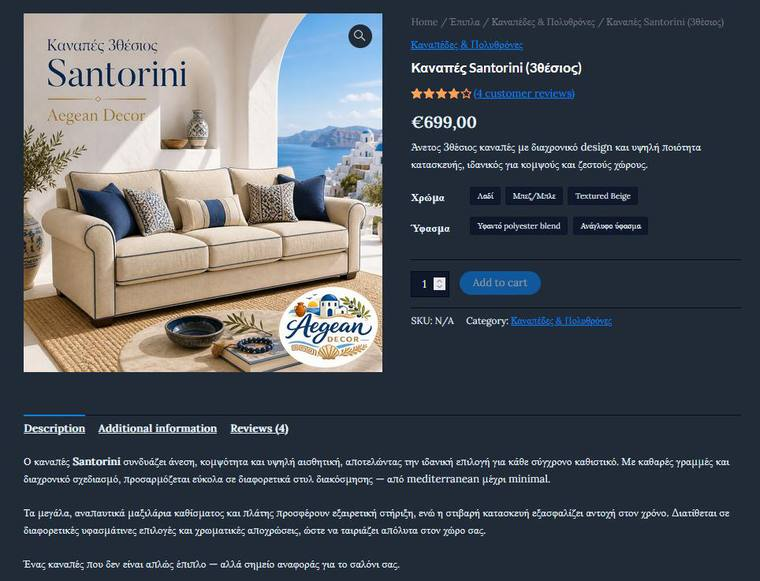
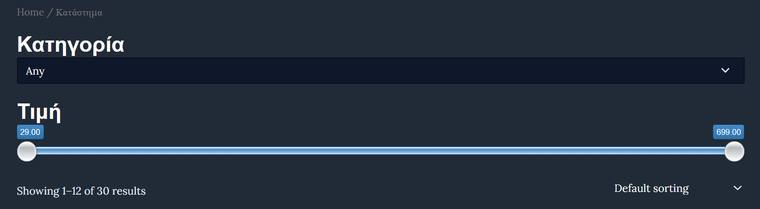

# Aegean Decor

<p align="center">
  
</p>

<p align="center"><strong>WordPress & WooCommerce e-commerce store for interior decoration products</strong></p>

<p align="center">WordPress · WooCommerce · Astra · XAMPP · PHP · MySQL</p>

> **University Team Project** — developed as part of an e-Business course project. The repository is presented as a portfolio case study and focuses on the e-commerce architecture, catalogue configuration, user experience, store operations, security, accessibility and marketing features implemented in the project.

## Live Demo

🌐 **[Visit Aegean Decor](https://dev-aegean-decor.pantheonsite.io)**

> Hosted on Pantheon.
## Overview

**Aegean Decor** is a Greek-language interior-decoration e-shop built with **WordPress** and **WooCommerce** in a local XAMPP environment.

The store was designed around a Mediterranean / Aegean visual identity and includes a structured product catalogue, variable products, product filtering, checkout and shipping configuration, coupons, reviews, content pages, SEO, GDPR support, accessibility features and security tooling.

## Store Showcase

| Homepage & Category Slider | Product Catalogue |
| --- | --- |
|  |  |

| Variable Product | Product Filtering |
| --- | --- |
|  |  |

## Key Features

### Product Catalogue
- 5 main product categories with multi-level subcategories
- 30 simple products distributed across the catalogue
- Product data including descriptions, pricing, stock status, images, dimensions, colours and materials
- 3 variable products with multiple attributes and variation-specific options

### Homepage & Merchandising
- Smart Slider 3 category slideshow
- Best-selling products section
- Top-rated products section
- Promotional display banners with calls to action
- Custom Mediterranean / Aegean visual identity

### Shopping & Checkout
- WooCommerce cart and checkout flow
- Cash on Delivery and bank-transfer payment methods
- Separate shipping zones for Greece and international orders
- Configured shipping and Cash on Delivery fees
- Coupon system supporting percentage discounts, fixed discounts and free shipping

### Product Discovery
- Product filtering by price
- Product filtering by rating
- Category-based catalogue navigation
- Variation swatches for configurable products

### Content & Customer Experience
- Product review system
- Blog with e-commerce and interior-design content
- Contact page with embedded map and Contact Form 7
- Terms of Use
- Privacy Policy
- Shipping & Payment information
- FAQ page

### Security, SEO & Accessibility
- Wordfence Security
- Yoast SEO
- GDPR / cookie-consent tooling
- WP Accessibility
- Sitemap and search-engine optimisation
- Contact and form handling

## Technology Stack

| Area | Technology |
| --- | --- |
| CMS | WordPress 6.9.4 |
| E-commerce | WooCommerce 10.7.0 |
| Theme | Astra |
| Local environment | XAMPP |
| Database | MySQL / MariaDB |
| Server-side | PHP |
| Front-end | HTML, CSS, WordPress blocks & theme customisation |

## Selected Plugins

- WooCommerce
- Smart Slider 3
- Wordfence Security
- Yoast SEO
- WP Accessibility
- Contact Form 7
- Variation Swatches
- WooCommerce AJAX Products Filter
- Payment Gateway Based Fees and Discounts
- GDPR / cookie-consent tooling
- All-in-One WP Migration and Backup

## Product Structure

The catalogue was organised into five main categories:

- **Furniture**
- **Lighting**
- **Decoration**
- **Textiles & Linen**
- **Storage & Organisation**

Each category contains dedicated subcategories, allowing customers to browse the catalogue hierarchically rather than through one flat product list.

## Example Variable Products

| Product | Attributes |
| --- | --- |
| Santorini Sofa | Colour, Fabric |
| Crete Chair | Colour, Material |
| Thira Vase | Shape, Colour |

## Repository Notes

This repository represents the development snapshot of a WordPress/WooCommerce project originally run locally through XAMPP.

For security, local configuration files, database exports, migration backups and runtime logs should **not** be committed to the public repository.

A safe local configuration template is provided as:

```text
decor-shop/wp-config.example.php
```

Copy it locally to `wp-config.php` and replace the placeholder values with your own environment-specific configuration.

## Local Setup

### Prerequisites
- XAMPP or an equivalent Apache / PHP / MySQL stack
- PHP compatible with the included WordPress version
- MySQL or MariaDB

### Basic workflow

1. Place the WordPress project in your local web-server directory.
2. Create a local database.
3. Copy:

```text
decor-shop/wp-config.example.php
```

to:

```text
decor-shop/wp-config.php
```

4. Update the database name, username, password and authentication salts.
5. Start Apache and MySQL.
6. Open the site through your local WordPress URL.

> Database dumps and production/local secrets are intentionally excluded from version control.

## Team

- **George Aggelis**
- **Petros Fousekis**

## Portfolio Context

The project demonstrates practical experience with:

- WordPress administration and configuration
- WooCommerce store architecture
- Product catalogue modelling
- Variable products and attributes
- E-commerce checkout and shipping rules
- Promotions and coupon logic
- UX-oriented catalogue navigation
- SEO, accessibility and GDPR tooling
- WordPress security practices
- Collaborative e-commerce development

## Screenshots

The screenshots in this README were extracted from the project's original documentation and show the implemented store interface.

## License & Third-Party Software

WordPress, WooCommerce, Astra and the listed plugins remain subject to their respective licenses.

This repository should not be interpreted as relicensing third-party WordPress core, theme or plugin code.
